Better diffs with difflib
=========================

Daniel Pope

``@lordmauve``

Code Review
-----------

.. slide::

    .. figure::  _static/code-review1.png
        :class: fill

.. slide::

    .. figure::  _static/1845903.png
        :class: fill

.. slide::

    .. figure::  _static/reviewboard.png
        :class: fill

Blockwise similarity matching
'''''''''''''''''''''''''''''

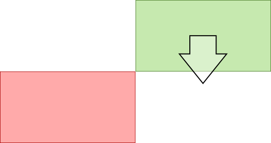

.. nextslide::

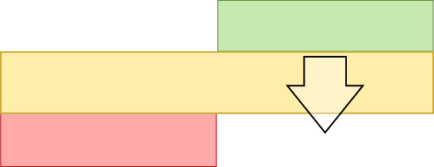

.. nextslide::

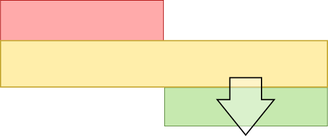

Line change highlighting
------------------------

Difflib
'''''''

.. code:: python

    >>> from difflib import SequenceMatcher
    >>> s = SequenceMatcher(None, "abxcd", "abcd")
    >>> s.get_matching_blocks()
    [Match(a=0, b=0, size=2), Match(a=3, b=2, size=2), Match(a=5, b=4, size=0)]

Showing line changes
''''''''''''''''''''

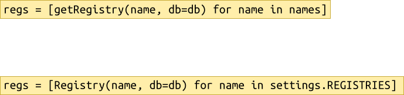

.. nextslide::

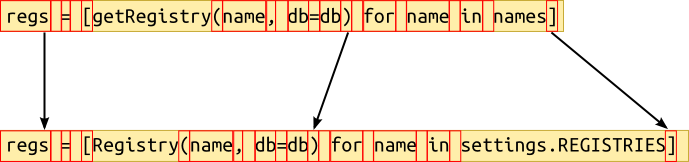

.. nextslide::

.. code:: python

    TOK_RE = re.compile(r'\w+|\s|[^\w\s]')
    s = SequenceMatcher(
        a=TOK_RE.findall(a),
        b=TOK_RE.findall(b),
    )

.. nextslide::

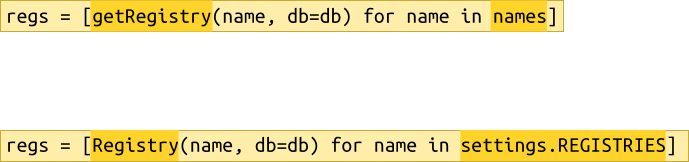

Back to block merging
---------------------

Diff-based line matching
''''''''''''''''''''''''

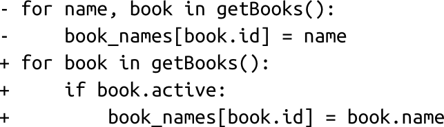

.. nextslide::

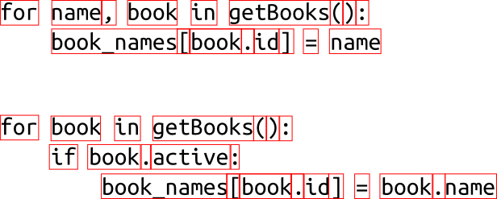

.. nextslide::

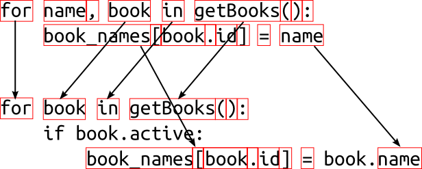

.. nextslide::

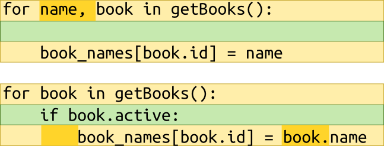

Linewise similarity check
'''''''''''''''''''''''''

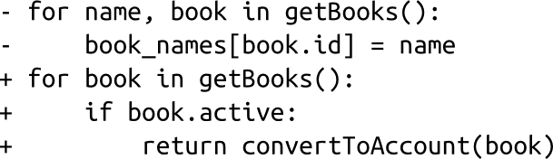

.. nextslide::

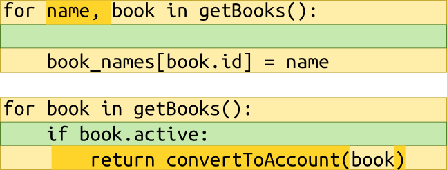

.. nextslide::

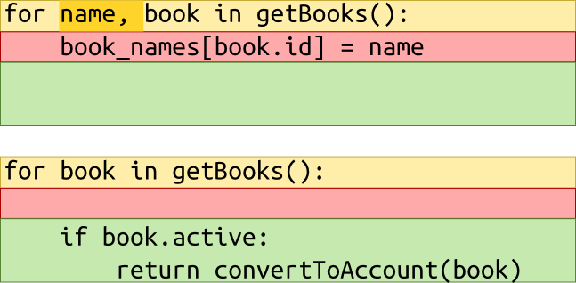

.. slide::

    .. figure::  _static/code-review2.png
        :class: fill

Links
'''''

Code is at

https://bitbucket.org/lordmauve/difflib-talk

You have been watching:
    Daniel Pope

twitter:
    ``@lordmauve``

blog:
    http://mauveweb.co.uk/
